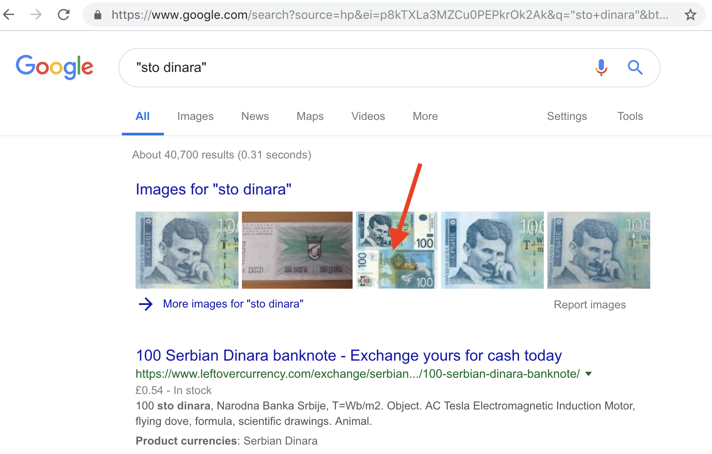
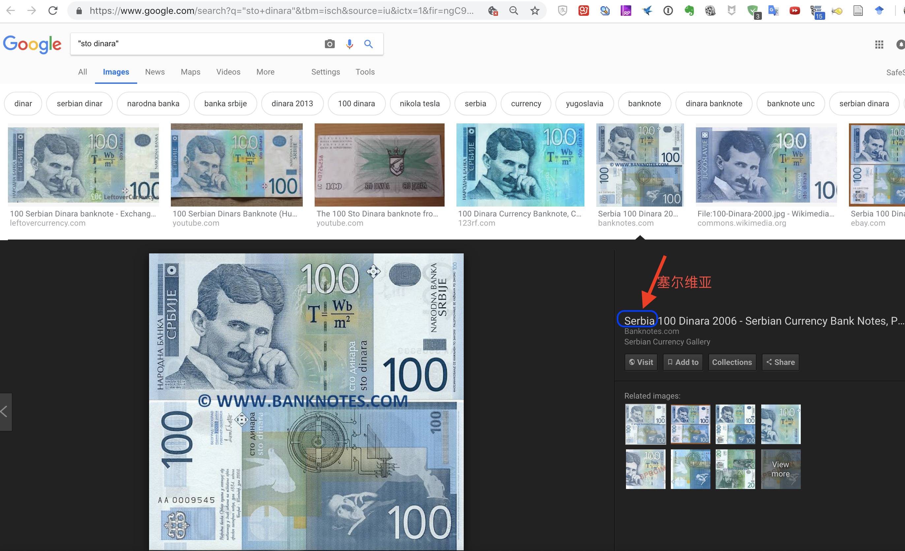
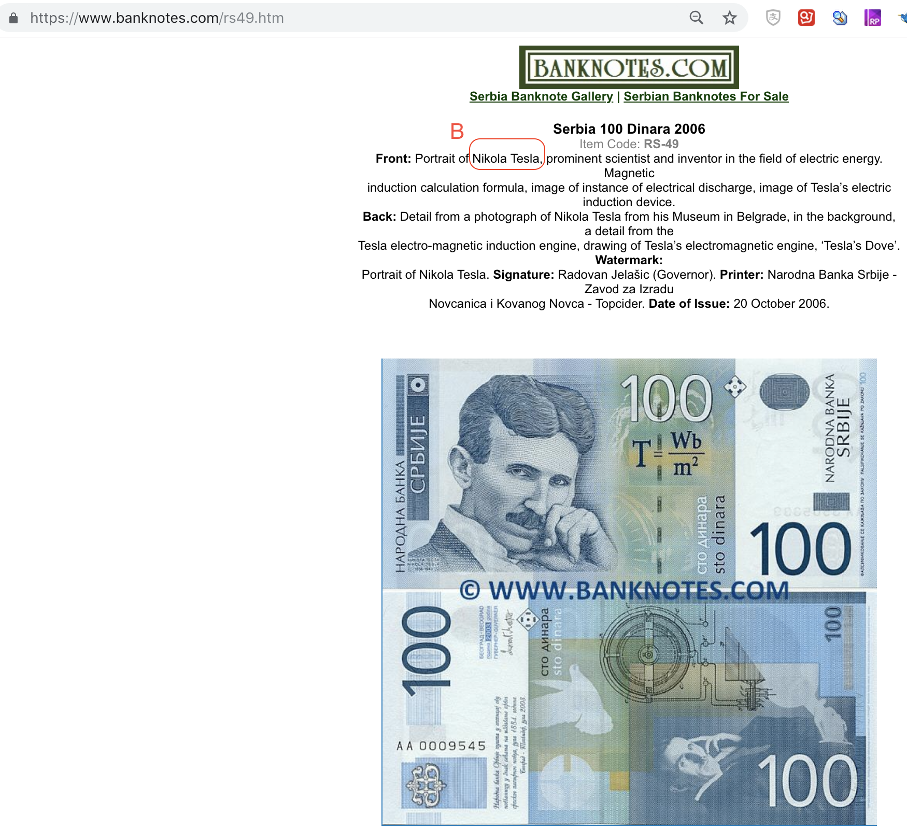
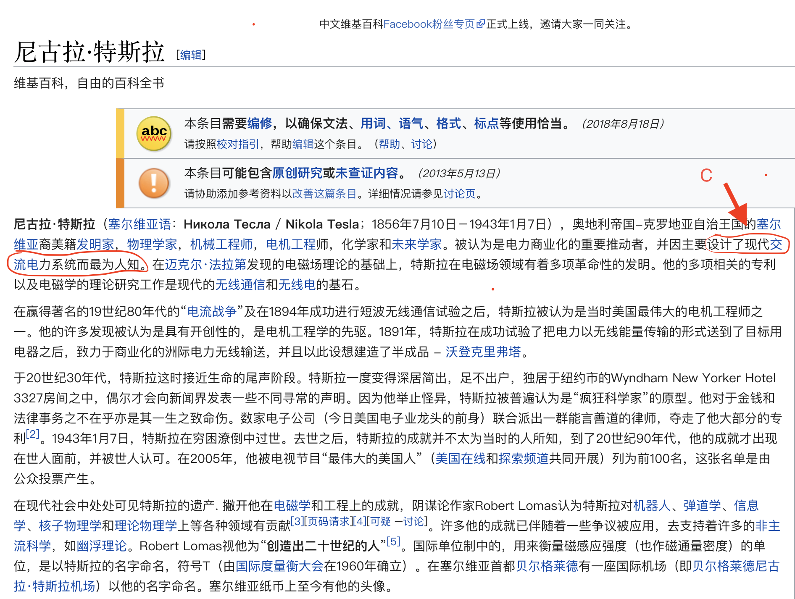
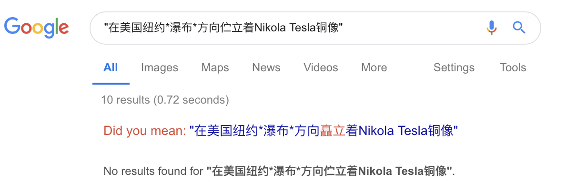
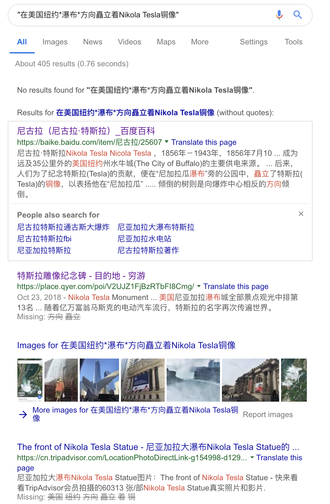

# 进阶作业01-信息分析报告

## 背景

这是 A 国 2006 年发行的纸币，用来纪念 20 世纪物理学家、发明家 B 。他精通多个领域，一生拥有上千项专利，最著名的发明是 C 。

为了纪念他，在美国纽约 D 瀑布 E 方向伫立着 B 的铜像，这座铜像具体地址是 F 。他拄着拐杖平静地凝望远方，夜幕降临，七彩霓虹随瀑布倾泻而下。

## 目标

检索出从 A~F 的答案，完成一份信息分析报告

## 步骤
根据图片上最清晰的内容，通过google.com搜索：
- 搜索“sto dinara”

- 点击image，得知A是`塞尔维亚`

- 解开B的迷底

继续点击上图的链接:

得知这一版纸币的发行是2006年为了纪念尼古拉·特斯拉，B是尼古拉·特斯拉。

- 伟大发明C是什么

在google.com输入`"尼古拉·特斯拉最著名的发明是什么？"`，第一个搜索结果是：

`https://zh.wikipedia.org/wiki/%E5%B0%BC%E5%8F%A4%E6%8B%89%C2%B7%E7%89%B9%E6%96%AF%E6%8B%89`

C是指交流电系统。

- 在google搜关键词“在美国纽约*瀑布*方向矗立着Nikola Tesla铜像”

google自动对关键词进行了优化“在美国纽约*瀑布*方向矗立着Nikola Tesla铜像"

得到以下搜索内容：

D是尼亚加拉瀑布。（因百度百科中有*尼加拉瓜瀑布*字样，后面还需交叉验证）

